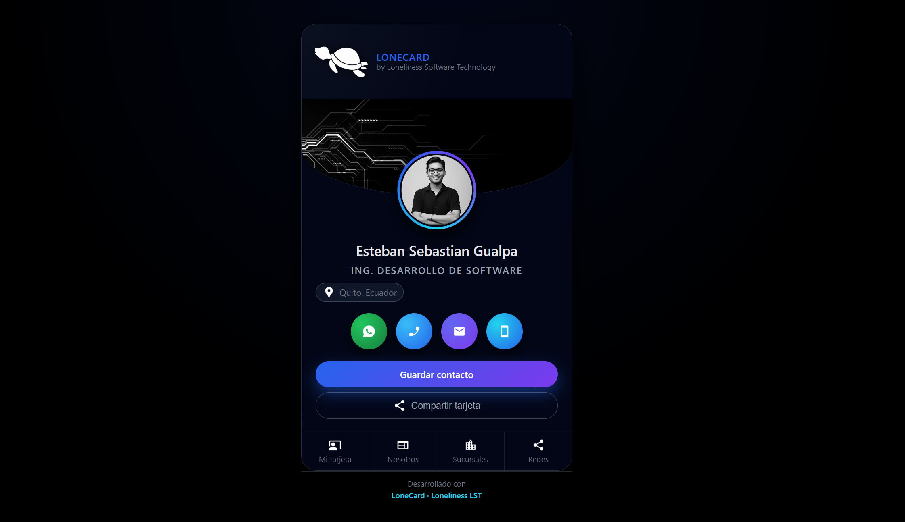

🐢 LoneCard — Tarjetas Digitales Dinámicas para Equipos Modernos

by Loneliness Software Technology (LST)

  

📌 Badges del Proyecto

      

🚀 ¿Qué es LoneCard?

LoneCard es un sistema moderno y dinámico para generar tarjetas digitales profesionales para colaboradores, usando:

1 solo archivo HTML

1 archivo JSON con los datos

Un diseño responsivo y moderno (LST UI)

Sin duplicar archivos, sin complicaciones, sin backend.

Ideal para:

✔️ Equipos corporativos
✔️ Empresas con rotación de personal
✔️ Identificación profesional rápida
✔️ Contacto directo desde la tarjeta (WhatsApp, email, teléfono)

⭐ Características principales
✔️ Totalmente dinámico

No se crea un HTML por cada colaborador.
La app carga la información desde:

/data/colaboradores.json

Usando una URL como:

index.html?id=LST00

✔️ QR permanentes

Los códigos QR no cambian, incluso cuando cambia el colaborador.
Solo editas el JSON.

✔️ Arquitectura profesional

Separación clara y mantenible:

assets/
   css/
   js/
   img/
data/
index.html
.htaccess
README.md

✔️ Seguridad lista para producción

El archivo .htaccess:

🔒 Oculta todos los directorios

📁 Impide explorar carpetas

📌 Fuerza index.html como archivo principal

🧩 Estructura del Proyecto
LoneCard/
│
├── assets/
│   ├── css/
│   │   ├── styles.css
│   │   └── responsive.css
│   ├── js/
│   │   ├── utils.js
│   │   ├── data.js
│   │   └── app.js
│   └── img/
│       ├── colaboradores/
│       ├── icons/
│       └── logos/
│
├── data/
│   └── colaboradores.json
│
├── index.html
├── .htaccess
└── README.md

⚙️ Cómo funciona

1️⃣ El QR apunta a algo como:

https://tudominio.com/lonecard/index.html?id=LST03

2️⃣ data.js obtiene el JSON
3️⃣ app.js renderiza dinámicamente la tarjeta
4️⃣ No hay necesidad de crear nuevos archivos

📱 Responsive & Modern UI (LST Design System)

✔️ Animaciones suaves
✔️ Glassmorphism
✔️ Colores corporativos LST
✔️ Íconos personalizados
✔️ Adaptación automática para:

Android

iPhone

Tablets

Escritorio

🛠 Instalación
🔹 Opción 1: GitHub Pages

Subir el repositorio a GitHub

Ir a: Settings → Pages

Seleccionar branch: main

Carpeta /root

Guardar

URL final será:

https://usuario.github.io/LoneCard/

🔹 Opción 2: Hosting / CPanel

Solo subir los archivos tal cual.

Asegúrate de incluir:

✔️ .htaccess
✔️ Carpeta assets/
✔️ Carpeta data/

🔹 Opción 3: Servidor privado / VPS

Recomendado para empresas.

🧭 Roadmap

 Animaciones premium LST

 Panel administrativo para gestionar colaboradores

 Multi-empresa / Multi-equipo

 Generador de QR integrado

 Versión API / Backend opcional

🤝 Cómo contribuir

Haz un fork

Crea una rama nueva:

git checkout -b feature/nueva-funcion

Agrega cambios y sube commits

Crea un Pull Request

📄 Licencia

Este proyecto está bajo la licencia MIT.
Total libertad para modificar y usar profesionalmente.

👨‍💻 Autor

Esteban Gualpa

Lead Developer — (LST)
